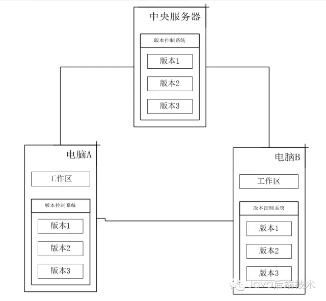

## git
### git核心概念
#### version control system  
* **本地版本控制（Local Version Control Systems）** 是将文件的各个版本以一定的数据格式存储在本地的磁盘（有的VCS 是保存文件的变化补丁，即在文件内容变化时计算出差量保存起来），这种方式在一定程度上解决了手动复制粘贴的问题，但无法解决多人协作的问题。
* **集中式版本控制（Centralized Version Control Systems）** 相比本地版本控制没有什么本质的变化，只是多了个一个中央服务器，各个版本的数据库存储在中央服务器，管理员可以控制开发人员的权限，而开发人员也可以从中央服务器拉取数据。集中式版本控制虽然解决了团队协作问题，但缺点也很明显：所有数据存储在中央服务器，服务器一旦宕机或者磁盘损坏，会造成不可估量的损失。
* **分布式版本控制（ Distributed Version Control System）** 与前两者均不同。首先，在分布式版本控制系统中，像 Git，系统保存的的`不是文件变化的差量，而是文件的快照`，即把文件的整体复制下来保存，而不关心具体的变化内容。其次，最重要的是分布式版本控制系统是分布式的，当你从中央服务器拷贝下来代码时，你拷贝的是一个完整的版本库，包括历史纪录，提交记录等，这样即使某一台机器宕机也能找到文件的完整备份。
 
#### git基础
Git每一次提交都是对项目文件的一个完整拷贝，因此你可以完全恢复到以前的任一个提交而不会发生任何区别。这里有一个问题：如果我的项目大小是10M，那Git占用的空间是不是随着提交次数的增加线性增加呢？我提交（commit）了10次，占用空间是不是100M呢？很显然不是，`Git是很智能的，如果文件没有变化，它只会保存一个指向上一个版本的文件的指针`，即，对于一个特定版本的文件，Git只会 保留一份。  
Git工程有三个工作区域：工作目录，暂存区域，以及本地仓库。工作目录是你当前进行工作的区域；暂存区域是你运行git add命令后文件保存的区域，也是下次提交将要保存的文件（注意：Git 提交实际读取的是暂存区域的内容，而与工作区域的文件无关，这也是当你修改了文件之后，如果没有添加git add到暂存区域，并不会保存到版本库的原因）；本地仓库就是版本库，记录了你工程某次提交的完整状态和内容，这意味着你的数据永远不会丢失。  
相应的，文件也有三种状态：已提交（committed），已修改（modified）和已暂存（staged）。已提交表示该文件已经被安全地保存在本地版本库中了；已修改表示修改了某个文件，但还没有提交保存；已暂存表示把已修改的文件放在下次提交时要保存的清单中，即暂存区域。所以使用Git的基本工作流程就是：  
 
1. 在工作区域增加，删除或者修改文件。
2. 运行git add，将文件快照保存到暂存区域。
3. 提交更新，将文件永久版保存到版本库中。
#### git指针引用
  
上图的Test.txt是第一次提交之前生成的，第一次它的初始 SHA-1 校验和以3c4e9c开头。随后对它进行了修改，所以第二次提交时生成了一个全新blob对象，校验和以1f7a7a开头。而第三次提交时Test.txt并没有变化，所以只是保存最近版本的 SHA-1 校验和而不生成全新的blob对象。在项目开发过程中新增加的文件在提交后都会生成一个全新的blob对象来保存它。注意除了第一次每个提交对象都有一个指向上一次提交对象的指针。