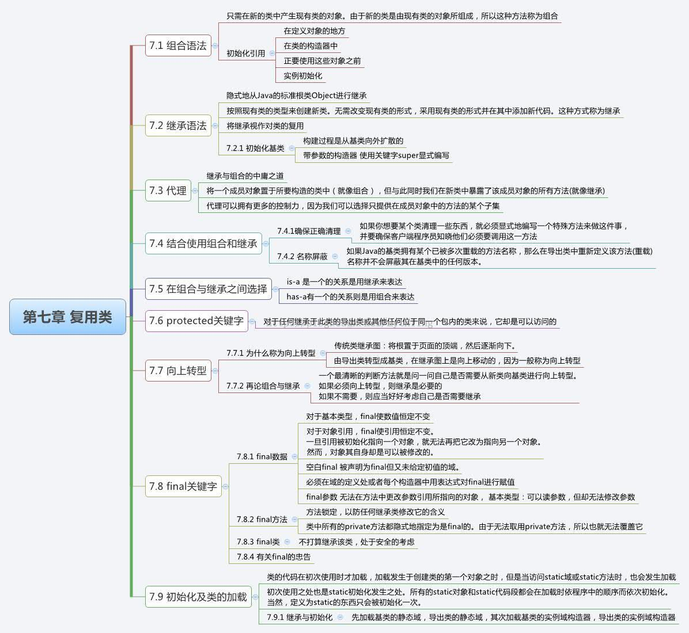

## java基础
### 类与对象
**1. 类的创建和初始化**  
* `不论变量放在哪儿，都会先于任意一个方法的执行前执行，包括构造方法`，而构造方法是一个类必须会执行的方法，不需要显示的进行调用。同时，不论变量在哪儿分布，只要在方法外部，就一定先于方法初始化。
* `静态块(包括类变量和类方法)`是在类的装载时执行的（装入.class文件后），且只执行一次。而非静态块是在调用构造方法之前执行的，每生成一个实例对象，就会调用一次非静态块。
* 执行顺序为：静态块，静态属性->非静态块，属性->构造器，静态块和静态属性或者非静态块和属性，初始化顺序决定于它们在代码中的顺序。  
    > 1. 先装载.class文件，创建Class对象，对静态数据（由static声明的）进行初始化，而且只进行一次初始化。  
    > 2. new Build()在堆上进行空间分配。  
    > 3. 执行非静态块。
    > 4. 执行所有方法外定义的变量的初始化。
    > 5. 执行构造器。
    > 6. 第3~5步作为原子整体，先完成父类，再完成子类  
* 创建子类对象时，无论子类的构造方法是否含参，如果没有特殊指明，`默认都是调用父类无参的构造方法`，如果父类只有含参的构造方法，`子类必须显示调用，否则编译报错`。 
* 类的构造器实际上是`静态方法`  
* 静态成员变量虽然独立于对象，但是不代表不可以通过对象去访问(this.的方式)，所有的静态方法和静态变量都可以通过对象访问（只要访问权限足够）

**2. Java属性**  
* **类属性**：前面已经说过就是那些声明为static的属性，在整个过程中只进行一次初始化，在内存中只开辟一个空间，不论在哪儿调用，值保持一致。一旦被修改，所有引用它的地方都会跟着修改。一般直接通过类名进行调用。
* **实例属性**：实例变量是可以不进行初始化，比如一个整型的实例变量假如没有初始化，则默认值为0；而局部变量假如不赋初值语法上是通过的，但是在使用这个变量是程序就报错了。实例变量在堆和栈中都分配内存空间，在堆当中分配的是对象本身，而栈中则是对这个对象的引用。
* **局部属性**：局部变量是在方法内部声明的变量，生命期仅在方法内，方法结束后变量就消失了；局部变量必须初始化再使用，否则会报错,也就是说，假如你在方法内定义了一个局部变量，并且没有赋值，那么你在使用这个变量的时候一定得赋值，不然就报错了。同时，`局部变量可屏蔽全局变量`。

**3. 抽象类和接口**  
* 抽象类是一种类，里面除了有抽象方法外，还可以有具体的方法，而接口里面必须都是抽象的方法(当然，java8中已有`default关键字`)。
* 抽象类中是可以没有抽象方法的；`有抽象方法的类必须是抽象类`；抽象类不一定有实体方法。
* 当我们继承抽象类时，必须重写其抽象方法。因为上述原因，所以抽象类`不能被声明为final类型`的，因为`加final关键字的类保证不能被继承`，因此为抽象类加final关键字，这个类就没法用了。`抽象类只能被继承，不能被实例化`！
* 在接口中，我们不能提供任何实现，所有方法必须都是抽象的，可以不加abstract关键字，但是编译器对于接口中的方法，都是直接按抽象方法处理的。`当我们实现某个接口时，必须重写其所有方法(除非用default关键字完成了该方法的默认实现)`。
* Java不支持多继承，但可以同时实现多个接口。  
* 在实现`匿名类`的时候可以直接new抽象类活接口，其他情况绝对不允许。
* 抽象类实现接口时: `不需要覆盖全部的接口方法`

【总结】抽象类与接口的区别和联系：  
> a)  抽象类是类，可以有实体方法。  
> b)  抽象类不能实现多继承，而接口可以。  
> c)  如果需要创建不带任何方法定义和成员变量的基类，则使用接口，如果类中需要有部分具体的实现，则使用抽象类。  
> d) 接口中的域默认是final、static的，我们可以通过类名来直接引用。  

**4. 内部类**  
 每个内部类都能独立继承自一个接口的实现，和外部类没有任何关系（不论外部类是否实现了该接口）。`内部类是Java多继承机制的完美补充`。实现多继承靠的是接口，光从类的角度说是没有多继承一说的。但是，如果现在非得用抽象类实现多继承，很明显是不可能的，此处就必须使用内部类。  
> 每个内部类都能独立的继承自一个（接口的）实现，所以无论外围类是否已经继承了某个实现，对于内部类都没有影响。
>利用内部类可以实现多重继承等好处，使用内部类还可以实现>java版的闭包和回调，而且比指针更灵活、更安全。

**5. 复合类: 继承、组合、代理**  

