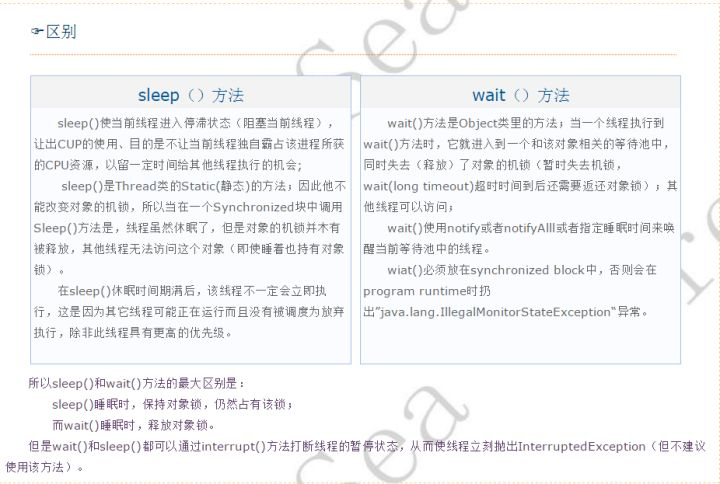

## java多线程
### sleep和wait的差别

* 首先，要记住这个差别，“sleep是Thread类的方法,wait是Object类中定义的方法”。尽管这两个方法都会影响线程的执行行为，但是本质上是有区别的。
* Thread.sleep不会导致锁行为的改变，如果当前线程是拥有锁的，那么Thread.sleep不会让线程释放锁。如果能够帮助你记忆的话，可以简单认为和锁相关的方法都定义在Object类中，因此调用Thread.sleep是不会影响锁的相关行为。
* Thread.sleep和Object.wait都会暂停当前的线程，对于CPU资源来说，不管是哪种方式暂停的线程，都表示它暂时不再需要CPU的执行时间。OS会将执行时间分配给其它线程。区别是，调用wait后，需要别的线程执行notify/notifyAll才能够重新获得CPU执行时间。  
* 线程的状态参考 Thread.State的定义。新创建的但是没有执行（还没有调用start())的线程处于“就绪”，或者说Thread.State.NEW状态。  
* Thread.State.BLOCKED（阻塞）表示线程正在获取锁时，因为锁不能获取到而被迫暂停执行下面的指令，一直等到这个锁被别的线程释放。BLOCKED状态下线程，OS调度机制需要决定下一个能够获取锁的线程是哪个，这种情况下，就是产生锁的争用，无论如何这都是很耗时的操作。
* sleep是TIMED_WAITING，wait不带计时参数是WAITING，带计时参数是TIMED_WAITING。java Thread的Blocked只是在等待内置锁时的状态，这些线程在阻塞的时候也不会占用CPU时间。
* 在多线程争用的情况，拥有锁的线程进行一些耗时操作，会极大降低吞吐量（amdahl定律），如果在同步块中使用sleep就是一种糟糕的做法，它不会释放锁却阻止其他线程获得锁，所以应该仔细设计分析，将这样的操作移出同步块。   
 